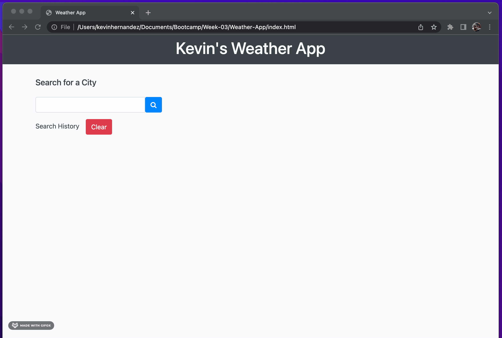

# Weather App

## Introduction
This weather app is another 3rd party API project designed to show off the power of a great simple and easy to use weather search page.

## Description
This weather app is a simple search app for you the user to search for any weather data from the openweathermap.org API. The results are stored within a local storage spot in your browser so you can see your previous searches as well.

## Check it out!
It's deployed here on github right now, feel free to take a look for yourself!
https://kh288.github.io/Weather-App/

## Features
<ul>
<li>Search any city you can think of and you'll get weather results</li>
<li>You get Temperature, Humidity, Wind speed, and UV Index information</li>
<li>Ability to look at your search history, and clear it at if desired</li>
</ul>

## Technologies Used
<ul>
<li>HTML</li>
<li>CSS / Bootstrap</li>
<li>Javascript</li>
    <ul>
    <li>jQuery</li>
    <li>Open weather API</li>
    </ul>
</ul>

## License

&copy; 2022 Kevin Hernandez, All Rights Reserved. Licensed under the [MIT License](./LICENSE)